# Projects and dependencies analysis

This document provides a comprehensive overview of the projects and their dependencies in the context of upgrading to .NETCoreApp,Version=v10.0.

## Table of Contents

- [Executive Summary](#executive-Summary)
  - [Highlevel Metrics](#highlevel-metrics)
  - [Projects Compatibility](#projects-compatibility)
  - [Package Compatibility](#package-compatibility)
  - [API Compatibility](#api-compatibility)
- [Aggregate NuGet packages details](#aggregate-nuget-packages-details)
- [Top API Migration Challenges](#top-api-migration-challenges)
  - [Technologies and Features](#technologies-and-features)
  - [Most Frequent API Issues](#most-frequent-api-issues)
- [Projects Relationship Graph](#projects-relationship-graph)
- [Project Details](#project-details)

  - [Library\AdaptiveCards.Rendering.Wpf.Xceed\AdaptiveCards.Rendering.Wpf.Xceed.csproj](#libraryadaptivecardsrenderingwpfxceedadaptivecardsrenderingwpfxceedcsproj)
  - [Library\AdaptiveCards.Rendering.Wpf\AdaptiveCards.Rendering.Wpf.csproj](#libraryadaptivecardsrenderingwpfadaptivecardsrenderingwpfcsproj)
  - [Library\AdaptiveCards.Templating.CSharp.WinRT\AdaptiveCards.Templating.WinRT.csproj](#libraryadaptivecardstemplatingcsharpwinrtadaptivecardstemplatingwinrtcsproj)
  - [Library\AdaptiveCards.Templating\AdaptiveCards.Templating.csproj](#libraryadaptivecardstemplatingadaptivecardstemplatingcsproj)
  - [Library\AdaptiveCards\AdaptiveCards.csproj](#libraryadaptivecardsadaptivecardscsproj)
  - [samples\AdaptiveCards.Sample.ImageRender\AdaptiveCards.Sample.ImageRender.csproj](#samplesadaptivecardssampleimagerenderadaptivecardssampleimagerendercsproj)
  - [Samples\ImageRendererServer\ImageRendererServer.csproj](#samplesimagerendererserverimagerendererservercsproj)
  - [Samples\WPFVisualizer.PackageProject\AdaptiveCards.Sample.WPFVisualizer.PackageProject.wapproj](#sampleswpfvisualizerpackageprojectadaptivecardssamplewpfvisualizerpackageprojectwapproj)
  - [Samples\WPFVisualizer\AdaptiveCards.Sample.WPFVisualizer.csproj](#sampleswpfvisualizeradaptivecardssamplewpfvisualizercsproj)
  - [Test\AdaptiveCards.Templating.Test\AdaptiveCards.Templating.Test.csproj](#testadaptivecardstemplatingtestadaptivecardstemplatingtestcsproj)
  - [Test\AdaptiveCards.Test\AdaptiveCards.Test.csproj](#testadaptivecardstestadaptivecardstestcsproj)

## Executive Summary

### Highlevel Metrics

| Metric | Count | Status |
| :--- | :---: | :--- |
| Total Projects | 11 | All require upgrade |
| Total NuGet Packages | 25 | 5 need upgrade |
| Total Code Files | 245 |  |
| Total Code Files with Incidents | 84 |  |
| Total Lines of Code | 45517 |  |
| Total Number of Issues | 3247 |  |
| Estimated LOC to modify | 3220+ | at least 7.1% of codebase |

### Projects Compatibility

| Project | Target Framework | Difficulty | Package Issues | API Issues | Est. LOC Impact | Description |
| :--- | :---: | :---: | :---: | :---: | :---: | :--- |
| [Library\AdaptiveCards.Rendering.Wpf.Xceed\AdaptiveCards.Rendering.Wpf.Xceed.csproj](#libraryadaptivecardsrenderingwpfxceedadaptivecardsrenderingwpfxceedcsproj) | net462 | 🟡 Medium | 0 | 64 | 64+ | Wpf, Sdk Style = True |
| [Library\AdaptiveCards.Rendering.Wpf\AdaptiveCards.Rendering.Wpf.csproj](#libraryadaptivecardsrenderingwpfadaptivecardsrenderingwpfcsproj) | net462 | 🟡 Medium | 1 | 2622 | 2622+ | Wpf, Sdk Style = True |
| [Library\AdaptiveCards.Templating.CSharp.WinRT\AdaptiveCards.Templating.WinRT.csproj](#libraryadaptivecardstemplatingcsharpwinrtadaptivecardstemplatingwinrtcsproj) | net6.0-windows10.0.19041.0 | 🟢 Low | 0 | 0 |  | ClassLibrary, Sdk Style = True |
| [Library\AdaptiveCards.Templating\AdaptiveCards.Templating.csproj](#libraryadaptivecardstemplatingadaptivecardstemplatingcsproj) | netstandard2.0;net6;net8 | 🟢 Low | 1 | 0 |  | ClassLibrary, Sdk Style = True |
| [Library\AdaptiveCards\AdaptiveCards.csproj](#libraryadaptivecardsadaptivecardscsproj) | netstandard2.0 | 🟡 Medium | 3 | 101 | 101+ | ClassLibrary, Sdk Style = True |
| [samples\AdaptiveCards.Sample.ImageRender\AdaptiveCards.Sample.ImageRender.csproj](#samplesadaptivecardssampleimagerenderadaptivecardssampleimagerendercsproj) | net462 | 🟢 Low | 1 | 1 | 1+ | DotNetCoreApp, Sdk Style = True |
| [Samples\ImageRendererServer\ImageRendererServer.csproj](#samplesimagerendererserverimagerendererservercsproj) | net462 | 🟢 Low | 6 | 17 | 17+ | AspNetCore, Sdk Style = True |
| [Samples\WPFVisualizer.PackageProject\AdaptiveCards.Sample.WPFVisualizer.PackageProject.wapproj](#sampleswpfvisualizerpackageprojectadaptivecardssamplewpfvisualizerpackageprojectwapproj) | net451 | 🟢 Low | 0 | 0 |  | DotNetCoreApp, Sdk Style = True |
| [Samples\WPFVisualizer\AdaptiveCards.Sample.WPFVisualizer.csproj](#sampleswpfvisualizeradaptivecardssamplewpfvisualizercsproj) | net48 | 🟡 Medium | 2 | 406 | 406+ | ClassicWinForms, Sdk Style = False |
| [Test\AdaptiveCards.Templating.Test\AdaptiveCards.Templating.Test.csproj](#testadaptivecardstemplatingtestadaptivecardstemplatingtestcsproj) | net6.0;net8.0 | 🟢 Low | 0 | 0 |  | DotNetCoreApp, Sdk Style = True |
| [Test\AdaptiveCards.Test\AdaptiveCards.Test.csproj](#testadaptivecardstestadaptivecardstestcsproj) | net5.0 | 🟢 Low | 2 | 9 | 9+ | DotNetCoreApp, Sdk Style = True |

### Package Compatibility

| Status | Count | Percentage |
| :--- | :---: | :---: |
| ✅ Compatible | 20 | 80.0% |
| ⚠️ Incompatible | 2 | 8.0% |
| 🔄 Upgrade Recommended | 3 | 12.0% |
| ***Total NuGet Packages*** | ***25*** | ***100%*** |

### API Compatibility

| Category | Count | Impact |
| :--- | :---: | :--- |
| 🔴 Binary Incompatible | 3035 | High - Require code changes |
| 🟡 Source Incompatible | 52 | Medium - Needs re-compilation and potential conflicting API error fixing |
| 🔵 Behavioral change | 133 | Low - Behavioral changes that may require testing at runtime |
| ✅ Compatible | 23786 |  |
| ***Total APIs Analyzed*** | ***27006*** |  |

## Aggregate NuGet packages details

| Package | Current Version | Suggested Version | Projects | Description |
| :--- | :---: | :---: | :--- | :--- |
| AdaptiveCards.Templating | 1.5.0 |  | [AdaptiveCards.Templating.WinRT.csproj](#libraryadaptivecardstemplatingcsharpwinrtadaptivecardstemplatingwinrtcsproj) | ✅Compatible |
| Antlr4.Runtime.Standard | 4.13.1 |  | [AdaptiveCards.Templating.csproj](#libraryadaptivecardstemplatingadaptivecardstemplatingcsproj) [AdaptiveCards.Templating.Test.csproj](#testadaptivecardstemplatingtestadaptivecardstemplatingtestcsproj) | ✅Compatible |
| AvalonEdit | 6.3.0.90 | 6.2.0.78 | [AdaptiveCards.Sample.WPFVisualizer.csproj](#sampleswpfvisualizeradaptivecardssamplewpfvisualizercsproj) | ⚠️NuGet package is incompatible |
| CompareNETObjects | 4.83.0 |  | [AdaptiveCards.Test.csproj](#testadaptivecardstestadaptivecardstestcsproj) | ✅Compatible |
| coverlet.collector | 6.0.2 |  | [AdaptiveCards.Templating.Test.csproj](#testadaptivecardstemplatingtestadaptivecardstemplatingtestcsproj) | ✅Compatible |
| Extended.Wpf.Toolkit | 4.6.0 |  | [AdaptiveCards.Rendering.Wpf.Xceed.csproj](#libraryadaptivecardsrenderingwpfxceedadaptivecardsrenderingwpfxceedcsproj) [AdaptiveCards.Sample.WPFVisualizer.csproj](#sampleswpfvisualizeradaptivecardssamplewpfvisualizercsproj) | ✅Compatible |
| McMaster.Extensions.CommandLineUtils | 4.1.1 |  | [AdaptiveCards.Sample.ImageRender.csproj](#samplesadaptivecardssampleimagerenderadaptivecardssampleimagerendercsproj) | ✅Compatible |
| Microsoft.AspNetCore | 2.3.9 |  | [ImageRendererServer.csproj](#samplesimagerendererserverimagerendererservercsproj) | NuGet package functionality is included with framework reference |
| Microsoft.AspNetCore.Mvc | 2.3.9 |  | [ImageRendererServer.csproj](#samplesimagerendererserverimagerendererservercsproj) | NuGet package functionality is included with framework reference |
| Microsoft.AspNetCore.Server.IIS | 2.2.6 |  | [ImageRendererServer.csproj](#samplesimagerendererserverimagerendererservercsproj) | ⚠️NuGet package is deprecated |
| Microsoft.AspNetCore.Server.IISIntegration | 2.3.9 |  | [ImageRendererServer.csproj](#samplesimagerendererserverimagerendererservercsproj) | NuGet package functionality is included with framework reference |
| Microsoft.AspNetCore.Server.Kestrel | 2.3.9 |  | [ImageRendererServer.csproj](#samplesimagerendererserverimagerendererservercsproj) | NuGet package functionality is included with framework reference |
| Microsoft.Bot.AdaptiveExpressions.Core | 4.23.1 |  | [AdaptiveCards.Templating.csproj](#libraryadaptivecardstemplatingadaptivecardstemplatingcsproj) [AdaptiveCards.Templating.Test.csproj](#testadaptivecardstemplatingtestadaptivecardstemplatingtestcsproj) | ✅Compatible |
| Microsoft.CSharp | 4.7.* | 4.7.0 | [AdaptiveCards.csproj](#libraryadaptivecardsadaptivecardscsproj) | NuGet package upgrade is recommended |
| Microsoft.NET.Test.Sdk | 17.9.0 |  | [AdaptiveCards.Templating.Test.csproj](#testadaptivecardstemplatingtestadaptivecardstemplatingtestcsproj) [AdaptiveCards.Test.csproj](#testadaptivecardstestadaptivecardstestcsproj) | ✅Compatible |
| Microsoft.Windows.CsWinRT | 2.1.1 |  | [AdaptiveCards.Templating.WinRT.csproj](#libraryadaptivecardstemplatingcsharpwinrtadaptivecardstemplatingwinrtcsproj) | ✅Compatible |
| MSTest.TestAdapter | 3.3.1 |  | [AdaptiveCards.Templating.Test.csproj](#testadaptivecardstemplatingtestadaptivecardstemplatingtestcsproj) [AdaptiveCards.Test.csproj](#testadaptivecardstestadaptivecardstestcsproj) | ✅Compatible |
| MSTest.TestFramework | 3.3.1 |  | [AdaptiveCards.Templating.Test.csproj](#testadaptivecardstemplatingtestadaptivecardstemplatingtestcsproj) [AdaptiveCards.Test.csproj](#testadaptivecardstestadaptivecardstestcsproj) | ✅Compatible |
| NETStandard.Library | 2.0.3 |  | [AdaptiveCards.csproj](#libraryadaptivecardsadaptivecardscsproj) [AdaptiveCards.Templating.csproj](#libraryadaptivecardstemplatingadaptivecardstemplatingcsproj) | ✅Compatible |
| Newtonsoft.Json | 13.0.3 | 13.0.4 | [AdaptiveCards.csproj](#libraryadaptivecardsadaptivecardscsproj) [AdaptiveCards.Rendering.Wpf.csproj](#libraryadaptivecardsrenderingwpfadaptivecardsrenderingwpfcsproj) [AdaptiveCards.Sample.WPFVisualizer.csproj](#sampleswpfvisualizeradaptivecardssamplewpfvisualizercsproj) [AdaptiveCards.Test.csproj](#testadaptivecardstestadaptivecardstestcsproj) | NuGet package upgrade is recommended |
| NuGet.CommandLine | 6.9.1 |  | [AdaptiveCards.Sample.WPFVisualizer.csproj](#sampleswpfvisualizeradaptivecardssamplewpfvisualizercsproj) | ✅Compatible |
| PolySharp | 1.14.1 |  | [AdaptiveCards.Templating.csproj](#libraryadaptivecardstemplatingadaptivecardstemplatingcsproj) | ✅Compatible |
| System.Net.Http | 4.3.* |  | [AdaptiveCards.csproj](#libraryadaptivecardsadaptivecardscsproj) [AdaptiveCards.Test.csproj](#testadaptivecardstestadaptivecardstestcsproj) | NuGet package functionality is included with framework reference |
| System.Net.Http | 4.3.4 |  | [AdaptiveCards.Sample.ImageRender.csproj](#samplesadaptivecardssampleimagerenderadaptivecardssampleimagerendercsproj) [ImageRendererServer.csproj](#samplesimagerendererserverimagerendererservercsproj) | NuGet package functionality is included with framework reference |
| System.Text.Json | 8.0.5 | 10.0.7 | [AdaptiveCards.Templating.csproj](#libraryadaptivecardstemplatingadaptivecardstemplatingcsproj) | NuGet package upgrade is recommended |

## Top API Migration Challenges

### Technologies and Features

| Technology | Issues | Percentage | Migration Path |
| :--- | :---: | :---: | :--- |
| WPF (Windows Presentation Foundation) | 1516 | 47.1% | WPF APIs for building Windows desktop applications with XAML-based UI that are available in .NET on Windows. WPF provides rich desktop UI capabilities with data binding and styling. Enable Windows Desktop support: Option 1 (Recommended): Target net9.0-windows; Option 2: Add <UseWindowsDesktop>true</UseWindowsDesktop>. |
| Speech & Voice Recognition | 32 | 1.0% | System.Speech APIs for speech recognition and synthesis that are not available in .NET Core/.NET. These Windows-specific APIs have been superseded by cloud-based services. Use Azure Cognitive Services Speech or other modern speech APIs. |
| GDI+ / System.Drawing | 4 | 0.1% | System.Drawing APIs for 2D graphics, imaging, and printing that are available via NuGet package System.Drawing.Common. Note: Not recommended for server scenarios due to Windows dependencies; consider cross-platform alternatives like SkiaSharp or ImageSharp for new code. |

### Most Frequent API Issues

| API | Count | Percentage | Category |
| :--- | :---: | :---: | :--- |
| T:System.Windows.FrameworkElement | 133 | 4.1% | Binary Incompatible |
| T:System.Windows.Visibility | 121 | 3.8% | Binary Incompatible |
| T:System.Uri | 98 | 3.0% | Behavioral Change |
| T:System.Windows.Controls.Grid | 97 | 3.0% | Binary Incompatible |
| T:System.Windows.Style | 93 | 2.9% | Binary Incompatible |
| T:System.Windows.UIElement | 90 | 2.8% | Binary Incompatible |
| T:System.Windows.GridLength | 79 | 2.5% | Binary Incompatible |
| T:System.Windows.Controls.UIElementCollection | 75 | 2.3% | Binary Incompatible |
| P:System.Windows.Controls.Panel.Children | 75 | 2.3% | Binary Incompatible |
| T:System.Windows.VerticalAlignment | 74 | 2.3% | Binary Incompatible |
| M:System.Windows.Controls.UIElementCollection.Add(System.Windows.UIElement) | 59 | 1.8% | Binary Incompatible |
| T:System.Windows.Thickness | 59 | 1.8% | Binary Incompatible |
| P:System.Windows.FrameworkElement.Style | 46 | 1.4% | Binary Incompatible |
| T:System.Windows.Controls.TextBlock | 42 | 1.3% | Binary Incompatible |
| T:System.Windows.ResourceDictionary | 42 | 1.3% | Binary Incompatible |
| T:System.Windows.Media.Brush | 41 | 1.3% | Binary Incompatible |
| T:System.Windows.Media.SolidColorBrush | 40 | 1.2% | Binary Incompatible |
| T:System.Windows.RoutedEventHandler | 38 | 1.2% | Binary Incompatible |
| P:System.Windows.UIElement.Visibility | 37 | 1.1% | Binary Incompatible |
| T:System.Windows.TextWrapping | 36 | 1.1% | Binary Incompatible |
| T:System.Windows.GridUnitType | 34 | 1.1% | Binary Incompatible |
| M:System.ComponentModel.DefaultValueAttribute.#ctor(System.Type,System.String) | 31 | 1.0% | Binary Incompatible |
| T:System.Windows.Controls.Button | 31 | 1.0% | Binary Incompatible |
| T:System.Windows.HorizontalAlignment | 28 | 0.9% | Binary Incompatible |
| T:System.Windows.Controls.ColumnDefinition | 28 | 0.9% | Binary Incompatible |
| P:System.Windows.FrameworkElement.VerticalAlignment | 26 | 0.8% | Binary Incompatible |
| M:System.Windows.Controls.Grid.#ctor | 26 | 0.8% | Binary Incompatible |
| T:System.Windows.Media.Stretch | 24 | 0.7% | Binary Incompatible |
| F:System.Windows.Visibility.Collapsed | 22 | 0.7% | Binary Incompatible |
| T:System.Windows.Controls.ColumnDefinitionCollection | 21 | 0.7% | Binary Incompatible |
| P:System.Windows.Controls.Grid.ColumnDefinitions | 21 | 0.7% | Binary Incompatible |
| P:System.Windows.Controls.ColumnDefinition.Width | 21 | 0.7% | Binary Incompatible |
| M:System.Windows.Controls.ColumnDefinition.#ctor | 21 | 0.7% | Binary Incompatible |
| P:System.Windows.FrameworkElement.Margin | 21 | 0.7% | Binary Incompatible |
| T:System.Windows.FontWeight | 20 | 0.6% | Binary Incompatible |
| P:System.Windows.Controls.TextBlock.Text | 20 | 0.6% | Binary Incompatible |
| P:System.Windows.FrameworkElement.DataContext | 19 | 0.6% | Binary Incompatible |
| T:System.Windows.Controls.RowDefinition | 19 | 0.6% | Binary Incompatible |
| F:System.Windows.Visibility.Visible | 19 | 0.6% | Binary Incompatible |
| M:System.Windows.Controls.TextBlock.#ctor | 18 | 0.6% | Binary Incompatible |
| M:System.Windows.GridLength.#ctor(System.Double,System.Windows.GridUnitType) | 17 | 0.5% | Binary Incompatible |
| T:System.Windows.Controls.StackPanel | 17 | 0.5% | Binary Incompatible |
| T:System.Windows.Controls.RowDefinitionCollection | 16 | 0.5% | Binary Incompatible |
| P:System.Windows.Controls.Grid.RowDefinitions | 16 | 0.5% | Binary Incompatible |
| P:System.Windows.FrameworkElement.Height | 16 | 0.5% | Binary Incompatible |
| T:System.Windows.Controls.Image | 16 | 0.5% | Binary Incompatible |
| M:System.Windows.Controls.Grid.SetColumn(System.Windows.UIElement,System.Int32) | 16 | 0.5% | Binary Incompatible |
| M:System.Windows.Controls.ColumnDefinitionCollection.Add(System.Windows.Controls.ColumnDefinition) | 16 | 0.5% | Binary Incompatible |
| P:System.Windows.GridLength.Auto | 15 | 0.5% | Binary Incompatible |
| T:System.Windows.Media.FontFamily | 14 | 0.4% | Binary Incompatible |

## Projects Relationship Graph

Legend:
📦 SDK-style project
⚙️ Classic project

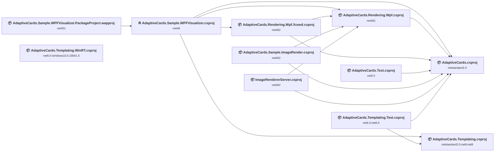

## Project Details

### Library\AdaptiveCards.Rendering.Wpf.Xceed\AdaptiveCards.Rendering.Wpf.Xceed.csproj

#### Project Info

- **Current Target Framework:** net462
- **Proposed Target Framework:** net10.0-windows
- **SDK-style**: True
- **Project Kind:** Wpf
- **Dependencies**: 2
- **Dependants**: 1
- **Number of Files**: 8
- **Number of Files with Incidents**: 7
- **Lines of Code**: 348
- **Estimated LOC to modify**: 64+ (at least 18.4% of the project)

#### Dependency Graph

Legend:
📦 SDK-style project
⚙️ Classic project

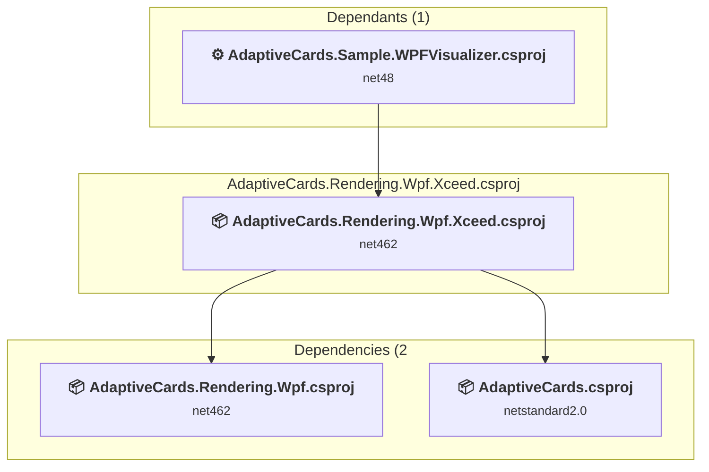

### API Compatibility

| Category | Count | Impact |
| :--- | :---: | :--- |
| 🔴 Binary Incompatible | 64 | High - Require code changes |
| 🟡 Source Incompatible | 0 | Medium - Needs re-compilation and potential conflicting API error fixing |
| 🔵 Behavioral change | 0 | Low - Behavioral changes that may require testing at runtime |
| ✅ Compatible | 251 |  |
| ***Total APIs Analyzed*** | ***315*** |  |

#### Project Technologies and Features

| Technology | Issues | Percentage | Migration Path |
| :--- | :---: | :---: | :--- |
| WPF (Windows Presentation Foundation) | 20 | 31.3% | WPF APIs for building Windows desktop applications with XAML-based UI that are available in .NET on Windows. WPF provides rich desktop UI capabilities with data binding and styling. Enable Windows Desktop support: Option 1 (Recommended): Target net9.0-windows; Option 2: Add <UseWindowsDesktop>true</UseWindowsDesktop>. |

### Library\AdaptiveCards.Rendering.Wpf\AdaptiveCards.Rendering.Wpf.csproj

#### Project Info

- **Current Target Framework:** net462
- **Proposed Target Framework:** net10.0-windows
- **SDK-style**: True
- **Project Kind:** Wpf
- **Dependencies**: 1
- **Dependants**: 4
- **Number of Files**: 38
- **Number of Files with Incidents**: 31
- **Lines of Code**: 5309
- **Estimated LOC to modify**: 2622+ (at least 49.4% of the project)

#### Dependency Graph

Legend:
📦 SDK-style project
⚙️ Classic project

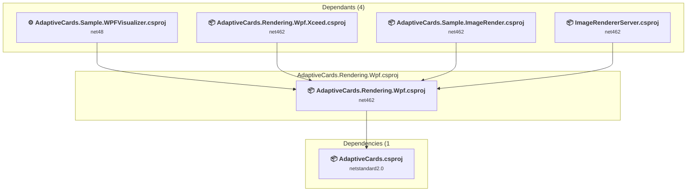

### API Compatibility

| Category | Count | Impact |
| :--- | :---: | :--- |
| 🔴 Binary Incompatible | 2583 | High - Require code changes |
| 🟡 Source Incompatible | 5 | Medium - Needs re-compilation and potential conflicting API error fixing |
| 🔵 Behavioral change | 34 | Low - Behavioral changes that may require testing at runtime |
| ✅ Compatible | 2309 |  |
| ***Total APIs Analyzed*** | ***4931*** |  |

#### Project Technologies and Features

| Technology | Issues | Percentage | Migration Path |
| :--- | :---: | :---: | :--- |
| GDI+ / System.Drawing | 4 | 0.2% | System.Drawing APIs for 2D graphics, imaging, and printing that are available via NuGet package System.Drawing.Common. Note: Not recommended for server scenarios due to Windows dependencies; consider cross-platform alternatives like SkiaSharp or ImageSharp for new code. |
| WPF (Windows Presentation Foundation) | 1316 | 50.2% | WPF APIs for building Windows desktop applications with XAML-based UI that are available in .NET on Windows. WPF provides rich desktop UI capabilities with data binding and styling. Enable Windows Desktop support: Option 1 (Recommended): Target net9.0-windows; Option 2: Add <UseWindowsDesktop>true</UseWindowsDesktop>. |

### Library\AdaptiveCards.Templating.CSharp.WinRT\AdaptiveCards.Templating.WinRT.csproj

#### Project Info

- **Current Target Framework:** net6.0-windows10.0.19041.0
- **Proposed Target Framework:** net10.0--windows10.0.19041.0
- **SDK-style**: True
- **Project Kind:** ClassLibrary
- **Dependencies**: 0
- **Dependants**: 0
- **Number of Files**: 1
- **Number of Files with Incidents**: 1
- **Lines of Code**: 45
- **Estimated LOC to modify**: 0+ (at least 0.0% of the project)

#### Dependency Graph

Legend:
📦 SDK-style project
⚙️ Classic project

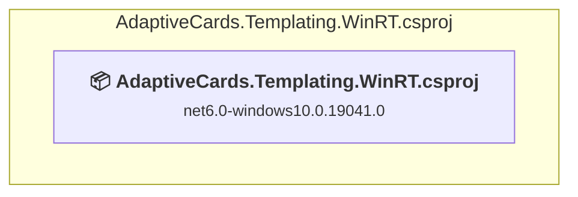

### API Compatibility

| Category | Count | Impact |
| :--- | :---: | :--- |
| 🔴 Binary Incompatible | 0 | High - Require code changes |
| 🟡 Source Incompatible | 0 | Medium - Needs re-compilation and potential conflicting API error fixing |
| 🔵 Behavioral change | 0 | Low - Behavioral changes that may require testing at runtime |
| ✅ Compatible | 382 |  |
| ***Total APIs Analyzed*** | ***382*** |  |

### Library\AdaptiveCards.Templating\AdaptiveCards.Templating.csproj

#### Project Info

- **Current Target Framework:** netstandard2.0;net6;net8
- **Proposed Target Framework:** netstandard2.0;net6;net8;net10.0
- **SDK-style**: True
- **Project Kind:** ClassLibrary
- **Dependencies**: 0
- **Dependants**: 2
- **Number of Files**: 10
- **Number of Files with Incidents**: 1
- **Lines of Code**: 2704
- **Estimated LOC to modify**: 0+ (at least 0.0% of the project)

#### Dependency Graph

Legend:
📦 SDK-style project
⚙️ Classic project

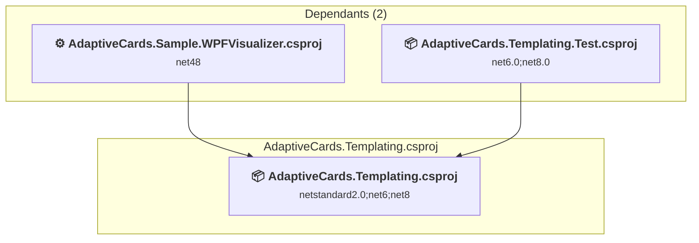

### API Compatibility

| Category | Count | Impact |
| :--- | :---: | :--- |
| 🔴 Binary Incompatible | 0 | High - Require code changes |
| 🟡 Source Incompatible | 0 | Medium - Needs re-compilation and potential conflicting API error fixing |
| 🔵 Behavioral change | 0 | Low - Behavioral changes that may require testing at runtime |
| ✅ Compatible | 1519 |  |
| ***Total APIs Analyzed*** | ***1519*** |  |

### Library\AdaptiveCards\AdaptiveCards.csproj

#### Project Info

- **Current Target Framework:** netstandard2.0✅
- **SDK-style**: True
- **Project Kind:** ClassLibrary
- **Dependencies**: 0
- **Dependants**: 7
- **Number of Files**: 157
- **Number of Files with Incidents**: 21
- **Lines of Code**: 15888
- **Estimated LOC to modify**: 101+ (at least 0.6% of the project)

#### Dependency Graph

Legend:
📦 SDK-style project
⚙️ Classic project

```mermaid
flowchart TB
    subgraph upstream["Dependants (7)"]
        P2["<b>⚙️&nbsp;AdaptiveCards.Sample.WPFVisualizer.csproj</b><br/><small>net48</small>"]
        P3["<b>📦&nbsp;AdaptiveCards.Rendering.Wpf.csproj</b><br/><small>net462</small>"]
        P4["<b>📦&nbsp;AdaptiveCards.Rendering.Wpf.Xceed.csproj</b><br/><small>net462</small>"]
        P5["<b>📦&nbsp;AdaptiveCards.Test.csproj</b><br/><small>net5.0</small>"]
        P6["<b>📦&nbsp;AdaptiveCards.Sample.ImageRender.csproj</b><br/><small>net462</small>"]
        P7["<b>📦&nbsp;ImageRendererServer.csproj</b><br/><small>net462</small>"]
        P10["<b>📦&nbsp;AdaptiveCards.Templating.Test.csproj</b><br/><small>net6.0;net8.0</small>"]
        click P2 "#sampleswpfvisualizeradaptivecardssamplewpfvisualizercsproj"
        click P3 "#libraryadaptivecardsrenderingwpfadaptivecardsrenderingwpfcsproj"
        click P4 "#libraryadaptivecardsrenderingwpfxceedadaptivecardsrenderingwpfxceedcsproj"
        click P5 "#testadaptivecardstestadaptivecardstestcsproj"
        click P6 "#samplesadaptivecardssampleimagerenderadaptivecardssampleimagerendercsproj"
        click P7 "#samplesimagerendererserverimagerendererservercsproj"
        click P10 "#testadaptivecardstemplatingtestadaptivecardstemplatingtestcsproj"
    end
    subgraph current["AdaptiveCards.csproj"]
        MAIN["<b>📦&nbsp;AdaptiveCards.csproj</b><br/><small>netstandard2.0</small>"]
        click MAIN "#libraryadaptivecardsadaptivecardscsproj"
    end
    P2 --> MAIN
    P3 --> MAIN
    P4 --> MAIN
    P5 --> MAIN
    P6 --> MAIN
    P7 --> MAIN
    P10 --> MAIN

```

### API Compatibility

| Category | Count | Impact |
| :--- | :---: | :--- |
| 🔴 Binary Incompatible | 31 | High - Require code changes |
| 🟡 Source Incompatible | 0 | Medium - Needs re-compilation and potential conflicting API error fixing |
| 🔵 Behavioral change | 70 | Low - Behavioral changes that may require testing at runtime |
| ✅ Compatible | 12962 |  |
| ***Total APIs Analyzed*** | ***13063*** |  |

### samples\AdaptiveCards.Sample.ImageRender\AdaptiveCards.Sample.ImageRender.csproj

#### Project Info

- **Current Target Framework:** net462
- **Proposed Target Framework:** net10.0
- **SDK-style**: True
- **Project Kind:** DotNetCoreApp
- **Dependencies**: 2
- **Dependants**: 0
- **Number of Files**: 1
- **Number of Files with Incidents**: 2
- **Lines of Code**: 137
- **Estimated LOC to modify**: 1+ (at least 0.7% of the project)

#### Dependency Graph

Legend:
📦 SDK-style project
⚙️ Classic project

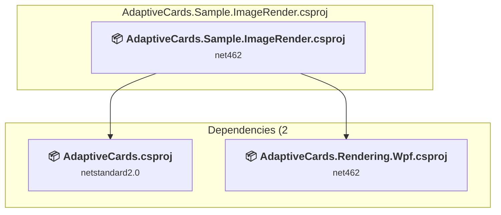

### API Compatibility

| Category | Count | Impact |
| :--- | :---: | :--- |
| 🔴 Binary Incompatible | 0 | High - Require code changes |
| 🟡 Source Incompatible | 1 | Medium - Needs re-compilation and potential conflicting API error fixing |
| 🔵 Behavioral change | 0 | Low - Behavioral changes that may require testing at runtime |
| ✅ Compatible | 183 |  |
| ***Total APIs Analyzed*** | ***184*** |  |

### Samples\ImageRendererServer\ImageRendererServer.csproj

#### Project Info

- **Current Target Framework:** net462
- **Proposed Target Framework:** net10.0
- **SDK-style**: True
- **Project Kind:** AspNetCore
- **Dependencies**: 2
- **Dependants**: 0
- **Number of Files**: 5
- **Number of Files with Incidents**: 5
- **Lines of Code**: 213
- **Estimated LOC to modify**: 17+ (at least 8.0% of the project)

#### Dependency Graph

Legend:
📦 SDK-style project
⚙️ Classic project

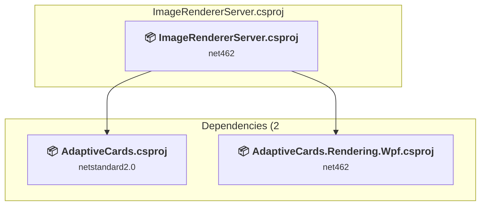

### API Compatibility

| Category | Count | Impact |
| :--- | :---: | :--- |
| 🔴 Binary Incompatible | 0 | High - Require code changes |
| 🟡 Source Incompatible | 12 | Medium - Needs re-compilation and potential conflicting API error fixing |
| 🔵 Behavioral change | 5 | Low - Behavioral changes that may require testing at runtime |
| ✅ Compatible | 113 |  |
| ***Total APIs Analyzed*** | ***130*** |  |

### Samples\WPFVisualizer.PackageProject\AdaptiveCards.Sample.WPFVisualizer.PackageProject.wapproj

#### Project Info

- **Current Target Framework:** net451
- **Proposed Target Framework:** net10.0
- **SDK-style**: True
- **Project Kind:** DotNetCoreApp
- **Dependencies**: 1
- **Dependants**: 0
- **Number of Files**: 18
- **Number of Files with Incidents**: 1
- **Lines of Code**: 0
- **Estimated LOC to modify**: 0+ (at least 0.0% of the project)

#### Dependency Graph

Legend:
📦 SDK-style project
⚙️ Classic project

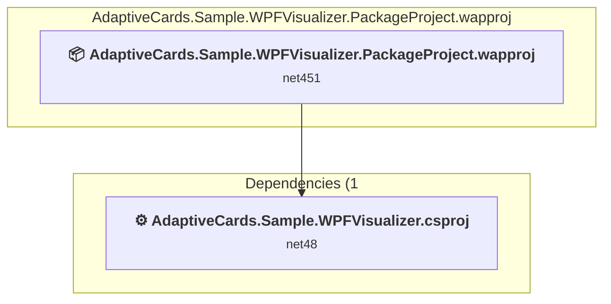

### API Compatibility

| Category | Count | Impact |
| :--- | :---: | :--- |
| 🔴 Binary Incompatible | 0 | High - Require code changes |
| 🟡 Source Incompatible | 0 | Medium - Needs re-compilation and potential conflicting API error fixing |
| 🔵 Behavioral change | 0 | Low - Behavioral changes that may require testing at runtime |
| ✅ Compatible | 0 |  |
| ***Total APIs Analyzed*** | ***0*** |  |

### Samples\WPFVisualizer\AdaptiveCards.Sample.WPFVisualizer.csproj

#### Project Info

- **Current Target Framework:** net48
- **Proposed Target Framework:** net10.0-windows
- **SDK-style**: False
- **Project Kind:** ClassicWinForms
- **Dependencies**: 4
- **Dependants**: 1
- **Number of Files**: 28
- **Number of Files with Incidents**: 10
- **Lines of Code**: 857
- **Estimated LOC to modify**: 406+ (at least 47.4% of the project)

#### Dependency Graph

Legend:
📦 SDK-style project
⚙️ Classic project

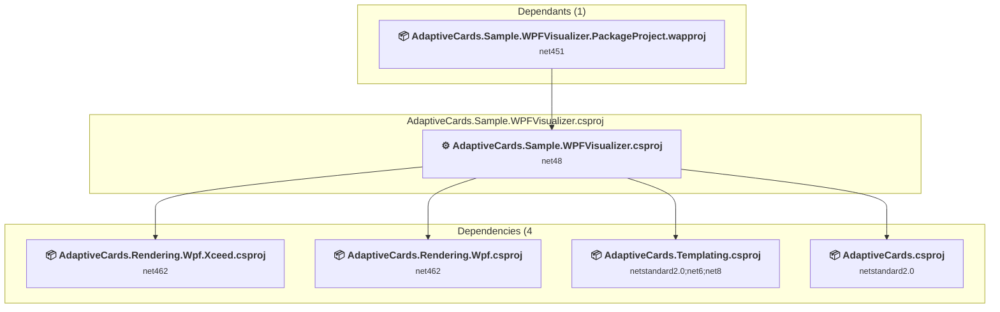

### API Compatibility

| Category | Count | Impact |
| :--- | :---: | :--- |
| 🔴 Binary Incompatible | 357 | High - Require code changes |
| 🟡 Source Incompatible | 34 | Medium - Needs re-compilation and potential conflicting API error fixing |
| 🔵 Behavioral change | 15 | Low - Behavioral changes that may require testing at runtime |
| ✅ Compatible | 895 |  |
| ***Total APIs Analyzed*** | ***1301*** |  |

#### Project Technologies and Features

| Technology | Issues | Percentage | Migration Path |
| :--- | :---: | :---: | :--- |
| Speech & Voice Recognition | 32 | 7.9% | System.Speech APIs for speech recognition and synthesis that are not available in .NET Core/.NET. These Windows-specific APIs have been superseded by cloud-based services. Use Azure Cognitive Services Speech or other modern speech APIs. |
| WPF (Windows Presentation Foundation) | 180 | 44.3% | WPF APIs for building Windows desktop applications with XAML-based UI that are available in .NET on Windows. WPF provides rich desktop UI capabilities with data binding and styling. Enable Windows Desktop support: Option 1 (Recommended): Target net9.0-windows; Option 2: Add <UseWindowsDesktop>true</UseWindowsDesktop>. |

### Test\AdaptiveCards.Templating.Test\AdaptiveCards.Templating.Test.csproj

#### Project Info

- **Current Target Framework:** net6.0;net8.0
- **Proposed Target Framework:** net6.0;net8.0;net10.0
- **SDK-style**: True
- **Project Kind:** DotNetCoreApp
- **Dependencies**: 2
- **Dependants**: 0
- **Number of Files**: 3
- **Number of Files with Incidents**: 1
- **Lines of Code**: 14390
- **Estimated LOC to modify**: 0+ (at least 0.0% of the project)

#### Dependency Graph

Legend:
📦 SDK-style project
⚙️ Classic project

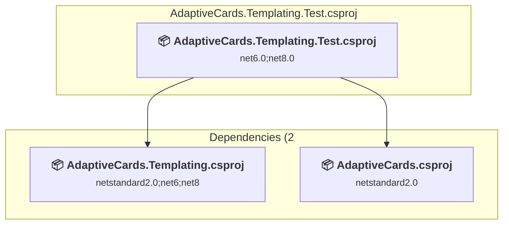

### API Compatibility

| Category | Count | Impact |
| :--- | :---: | :--- |
| 🔴 Binary Incompatible | 0 | High - Require code changes |
| 🟡 Source Incompatible | 0 | Medium - Needs re-compilation and potential conflicting API error fixing |
| 🔵 Behavioral change | 0 | Low - Behavioral changes that may require testing at runtime |
| ✅ Compatible | 1019 |  |
| ***Total APIs Analyzed*** | ***1019*** |  |

### Test\AdaptiveCards.Test\AdaptiveCards.Test.csproj

#### Project Info

- **Current Target Framework:** net5.0
- **Proposed Target Framework:** net10.0
- **SDK-style**: True
- **Project Kind:** DotNetCoreApp
- **Dependencies**: 1
- **Dependants**: 0
- **Number of Files**: 19
- **Number of Files with Incidents**: 4
- **Lines of Code**: 5626
- **Estimated LOC to modify**: 9+ (at least 0.2% of the project)

#### Dependency Graph

Legend:
📦 SDK-style project
⚙️ Classic project

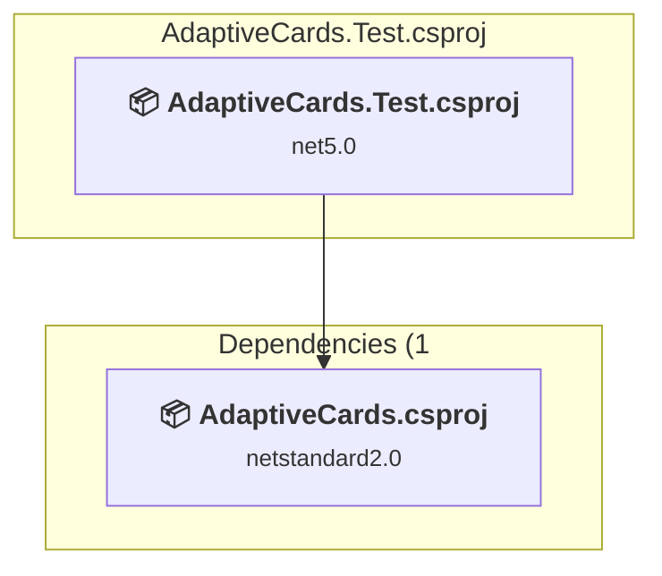

### API Compatibility

| Category | Count | Impact |
| :--- | :---: | :--- |
| 🔴 Binary Incompatible | 0 | High - Require code changes |
| 🟡 Source Incompatible | 0 | Medium - Needs re-compilation and potential conflicting API error fixing |
| 🔵 Behavioral change | 9 | Low - Behavioral changes that may require testing at runtime |
| ✅ Compatible | 4153 |  |
| ***Total APIs Analyzed*** | ***4162*** |  |

